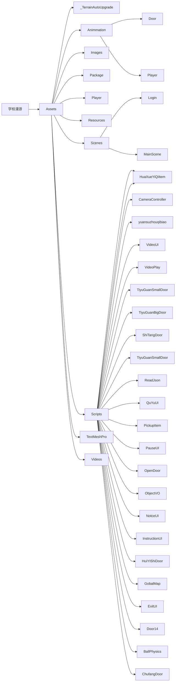

```mermaid
graph LR
A[学校漫游]-->B[Assets]
B-->C[_TerrainAutoUpgrade]
B-->D[Animmation]
B-->E[Images]
B-->F[Package]
B-->G[Player]
B-->H[Resources]
B-->I[Scenes]
B-->J[Scripts]
B-->K[TextMeshPro]
B-->L[Videos]
D-->ab[Door]
D-->ac[Player]
I-->ad[Login]
I-->ae[MainScene]
J-->bc[LoginUI]
J-->ba[CameraController]
J-->bf[yuansuzhouqibiao]
J-->bg[VideoUI]
J-->bh[VideoPlay]
J-->bk[TiyuGuanSmallDoor]
J-->bl[TiyuGuanBigDoor]
J-->bq[ShiTangDoor]
J-->bw[TiyuGuanSmallDoor]
J-->be[ReadJson]
J-->br[QuYuUI]
J-->bt[PickupItem]
J-->by[PauseUI]
J-->bu[OpenDoor]
J-->bi[ObjectVO]
J-->bo[NotceUI]
J-->bp[InstructionUI]
J-->bx[HuiYIShiDoor]
J-->bc[HuaXueYiQiItem]
J-->bv[GobalMap]
J-->bb[ExitUI]
J-->bn[Door14]
J-->bm[BallPhysics]
J-->baa[ChufangDoor]


```

