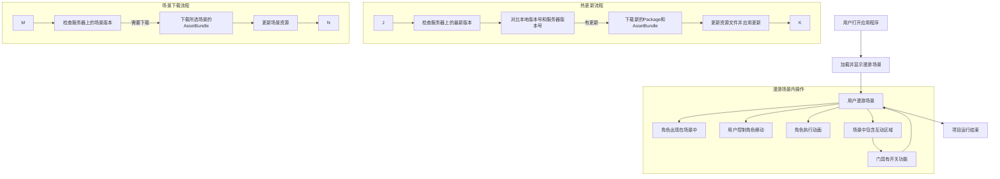

```mermaid
graph TB  
    A[用户打开应用程序]  
    B[加载并显示漫游场景]  
    A --> B  
    C[用户漫游场景]  
    B --> C  
    D[项目运行结束]  
    C --> D  
    
  subgraph "热更新流程"  
        J --> JS[检查服务器上的最新版本]  
        JS --> JT[对比本地版本号和服务器版本号]  
        JT -- 有更新 --> JD[下载新的Package和AssetBundle]  
        JD --> JA[更新资源文件并应用更新]  
        JA --> K  
    end  
      
    subgraph "场景下载流程"  
        M --> MS[检查服务器上的场景版本]  
        MS -- 需要下载 --> MD[下载所选场景的AssetBundle]  
        MD --> MN[更新场景资源]  
        MN --> N  
    end  
    subgraph "漫游场景内操作"  
        C --> E[角色出现在场景中]  
        C --> F[用户控制角色移动]  
        C --> G[角色执行动画]  
        C --> H[场景中包含互动区域]  
        H --> I[门具有开关功能]  
        I --> C  
    end
```

